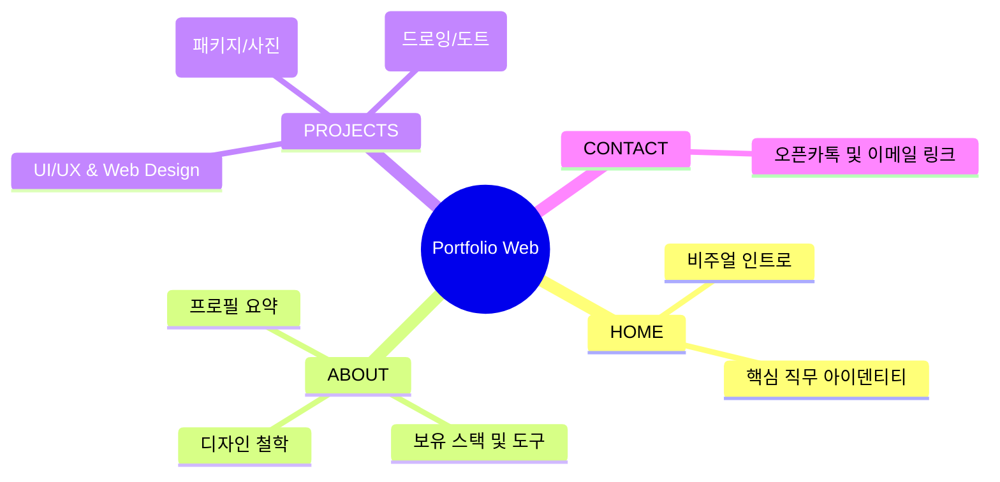
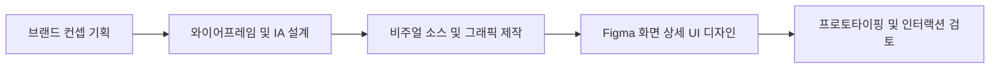

# 🎨 포트폴리오 김유진- Personal Portfolio Website

> 개성 있는 그래픽 리소스와 인터랙티브 화면 설계를 결합한 UI/UX · 비주얼 디자이너 '읭딩'의 공식 포트폴리오 웹사이트 프로젝트입니다.

---

## 📌 1. 프로젝트 개요

| 구분 | 내용 |
|---|---|
| **프로젝트명** | 읭딩 개인 포트폴리오 웹사이트 구축 |
| **디자인 컨셉** | Orange & Dark 테마를 활용한 개성 있고 트렌디한 비주얼 브랜딩 |
| **주요 목적** | 다채로운 디자인 스택(UI/UX, 일러스트, 3D, 모션)을 직관적인 아키텍처로 증명 |
| **핵심 역할** | 브랜드 아이덴티티 수립, 웹 인터페이스 레이아웃 설계 및 그래픽 자산 제작 |

---

## ⚙️ 2. 웹사이트 정보 구조 (IA)

방문자가 헤매지 않고 디자이너의 다채로운 스택을 효율적으로 탐색할 수 있도록 설계한 포트폴리오 구조입니다.

---

## 🎨 3. 제작 및 사용 도구

포트폴리오 내의 다양한 시각 소스와 레이아웃을 빌드하기 위해 사용된 도구 라인업입니다.

`Figma` `Photoshop` `Illustrator` `After Effects` `Aseprite` `Spine` `Clip Studio Paint`

---

## 📂 4. 포트폴리오 섹션별 설계 방향

| 섹션명 | 주요 설계 포인트 및 포함 리소스 | 활용 툴 |
|---|---|---|
| **INTRO & ABOUT** | Orange 컬러 중심의 힙한 브랜딩, 명확한 직무 역량 표기 및 소개 레이아웃 설계 | Figma, Photoshop |
| **UI/UX & WEB** | 사용 흐름을 고려한 웹·앱 인터페이스 가이드라인 및 목업 화면 배치 | Figma |
| **GRAPHIC DESIGN** | 패키지 디자인 시각화, 고품질 사진 촬영 및 그래픽 리소스 가공 | Photoshop, Illustrator |
| **ILLUST & CHARACTER**| 독창적인 일러스트레이션, 도트 그래픽(픽셀 아트), 만화 연출 리소스 아카이빙 | Clip Studio, Aseprite |

---

## ⚙️ 5. 작업 프로세스

기획 단계부터 다양한 그래픽 소스들을 통합하여 하나의 일관된 포트폴리오 웹 경험으로 완성해 나가는 과정입니다.

---

## 📧 Contact

| 구분 | 링크/정보 |
|---|---|
| **Email** | your-email@example.com |
| **Portfolio Link** | 준비 중 (또는 배포 주소) |
| **GitHub** | https://github.com |
